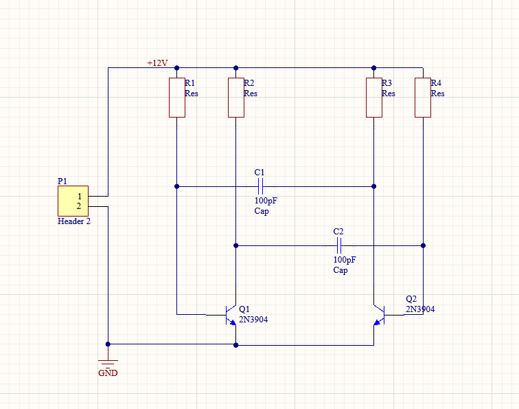
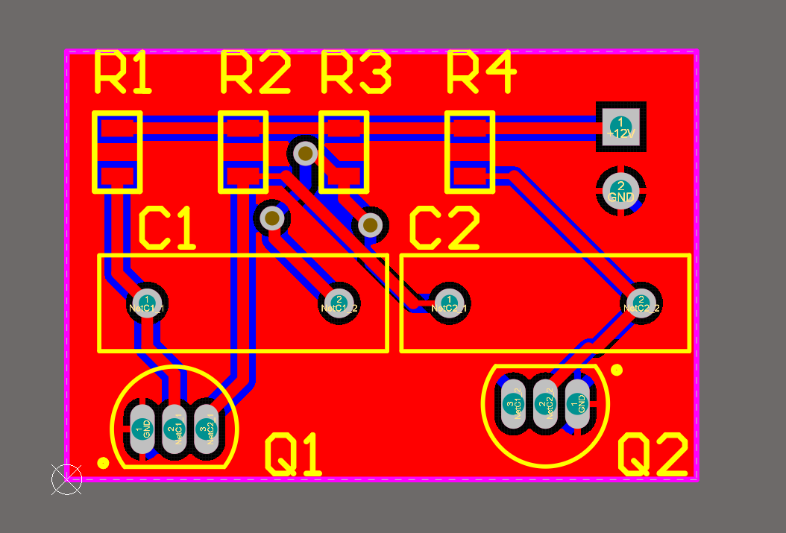
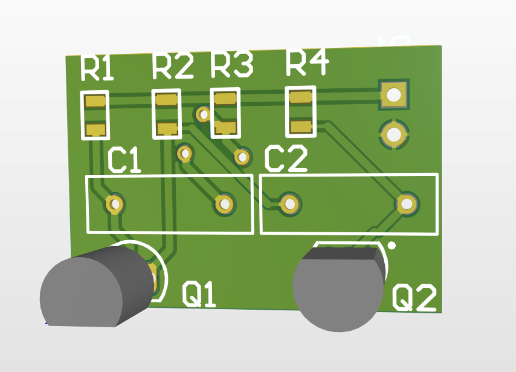

# caudell441
# Проєкт: Мультивібратор на Altium Designer

Цей репозиторій містить файли проєкту мультивібратора, розробленого в програмному забезпеченні **Altium Designer**. Проєкт виконаний в рамках університетської практики.

---

## 👨‍💻 Про автора

* **Ім'я:** Косенко Ігор
* **Група:** ЕС-231Б
* **Університет:** Київський авіаційний інститут (КАІ)
* **Дисципліна:** Електронні системи

---

## 💡 Опис проєкту

Мультивібратор — це електронний генератор прямокутних імпульсів. У цьому проєкті реалізовано **астабільний мультивібратор**, який є ключовим елементом у багатьох електронних пристроях для генерації тактових імпульсів, перемикання або формування сигналів.

Проєкт включає в себе:
* Схему електричну принципову (Schematic).
* Розробку друкованої плати (PCB Layout).
* 3D-модель плати.

---

## 🛠️ Використані інструменти

* **Altium Designer** – провідне програмне забезпечення для автоматизованого проєктування електроніки, що використовувалося для створення схеми та розробки друкованої плати.

---

## 📸 Скріншоти проєкту

Тут представлені ключові етапи та результати роботи над мультивібратором в Altium Designer.

### Принципова схема

*Опис: Принципова схема мультивібратора, розроблена в Altium Designer.*

### Розміщення компонентів та трасування плати (PCB Layout)

*Опис: Вид друкованої плати з розміщеними компонентами та трасуванням доріжок.*

### 3D-вигляд плати

*Опис: 3D-модель друкованої плати мультивібратора, що показує її фізичні розміри та розташування компонентів.*

---

## 📂 Структура репозиторію
.
├── images/
│   ├── schematic.png         # Скріншот принципової схеми
│   ├── pcb_layout.png        # Скріншот PCB Layout
│   └── 3d_view.png           # Скріншот 3D-вигляду плати
├── Practica.PrjPcb           # Файл проєкту Altium Designer
├── Sheet1.SchDoc             # Файл принципової схеми
├── PCB1.PcbDoc               # Файл друкованої плати
└── README.md                 # Цей файл
